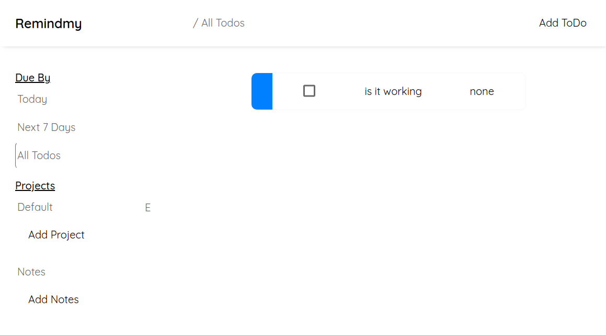

# To-Do-App

## Live Demo:
[See the TO-DO APP here!](https://sahilcreate.github.io/To-Do-App/)  

## ABOUT THE PROJECT
In this project we were asked to build to to-do app with ES6 modular approach. We were asked create dynamic object and handle separate logic for UI and Application. It also uses `localStorage` which means we were supposed to have a basic grasp of JSON and how to use it.

## OBJECTIVES
- [x] use dynamically created objects for 'todo' added
- [x] add properties for todo-item
    - [x] title
    - [x] description
    - [x] dueDate
    - [x] priority
    - [x] note or checklist
- [x] project list
- [x] default project
- [x] add new projects
- [x] separate logic (application & DOM-related stuff)
- [x] UI
    - [x] view all project
    - [x] view todos for each project
    - [x] expand todo to see/edit its details
    - [x] delete a todo
- [x] use `localStorage` and make sure app doesn't crash if data isn't there in  storage.

## SCOPE CREEP
- [x] change project name
- [x] add checklist for each to-do
- [x] can edit any detail about to-do (expect `submitDate`)
- [x] can change name of projects (even default)
- [x] add notes (with `title` & `description`)
- [ ] add sort options for priority, dueDate, submitDate, A-Z or Z-A
- [ ] add cloud storage (Auth)
- [ ] Make it responsive and Accessible (it's in dire state currently)
- [ ] refactor the code future me (sometimes even i don't understand what i did)
- [ ] learn CSS properly (it's a global scope variable!)
- [ ] use SVGs for better readability

## INSTRUCTION TO USE
- `Add Project` button will let add your own project
- `E` button in front of every project will let you edit name of project or delete it
- you can not delete `Default` project. You can however change it's name
- Every to-do of deleted project will change it's project to `Default`
- `Add To-Do` button will add a `todo` and open the project page which is selected
- `Add Note` button will let you add a note with it's description

## CREDITS
- font [QuickSand](https://fonts.google.com/specimen/Quicksand) by Google